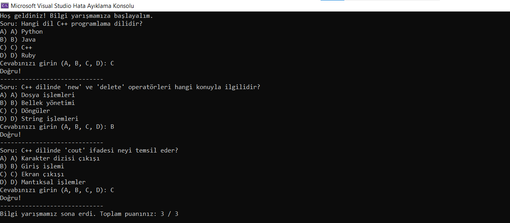

# Bilgi Yarışması Uygulaması

Bu C++ programı, basit bir bilgi yarışması uygulamasını gerçekleştirir. Kullanıcıya çeşitli sorular sorulur ve doğru cevapları doğruluk kontrolü yapılır. Programın genel işleyişi şu adımları içerir:

## Nasıl Çalışır?

1. **Soru Sınıfı (`Question`):**
   - `Question` sınıfı, bir soruyu, seçenekleri ve doğru cevabı temsil eder.
   - Soru metni, seçenekler ve doğru cevap oluşturulurken sınıfa parametre olarak verilir.

2. **Bilgi Yarışması Sınıfı (`Quiz`):**
   - `Quiz` sınıfı, bir dizi soruyu içerir ve bu soruları kullanıcıya sorar.
   - `addQuestion` fonksiyonu, bir soruyu sorular listesine ekler.
   - `startQuiz` fonksiyonu, bilgi yarışmasını başlatır ve kullanıcının cevaplarını kontrol eder.

3. **Ana Fonksiyon (`main`):**
   - `main` fonksiyonu, `Quiz` sınıfını kullanarak bir bilgi yarışması oluşturur.
   - Üç adet soru oluşturulur ve bu sorular bilgi yarışmasına eklenir.
   - `startQuiz` fonksiyonu, bilgi yarışmasını başlatır ve kullanıcının cevaplarına göre puanlama yapar.

## Sorular ve Cevaplar

1. "Hangi dil C++ programlama dilidir?"
   - A) Python
   - B) Java
   - C) C++
   - D) Ruby
   - Doğru Cevap: C

2. "C++ dilinde 'new' ve 'delete' operatörleri hangi konuyla ilgilidir?"
   - A) Dosya işlemleri
   - B) Bellek yönetimi
   - C) Döngüler
   - D) String işlemleri
   - Doğru Cevap: B

3. "C++ dilinde 'cout' ifadesi neyi temsil eder?"
   - A) Karakter dizisi çıkışı
   - B) Giriş işlemi
   - C) Ekran çıkışı
   - D) Mantıksal işlemler
   - Doğru Cevap: C

## Örnek Kullanım

```cpp
int main() {
    setlocale(LC_ALL, "Turkish");
    Quiz quiz;

    Question q1("Hangi dil C++ programlama dilidir?",
        { "A) Python", "B) Java", "C) C++", "D) Ruby" }, 'C');

    // Diğer soruların oluşturulması

    quiz.addQuestion(q1);
    // Diğer soruların eklenmesi

    quiz.startQuiz();

    return 0;
}
```


# Ekran Resmi


# Bilgilendirme
**---------------------------------------------------------**
| Herkese Açık | Geliştirilebilir | Zyra Software|
|---------|---------|---------|
| Açık | Geliştirilebilir |@zyrasoftware |

